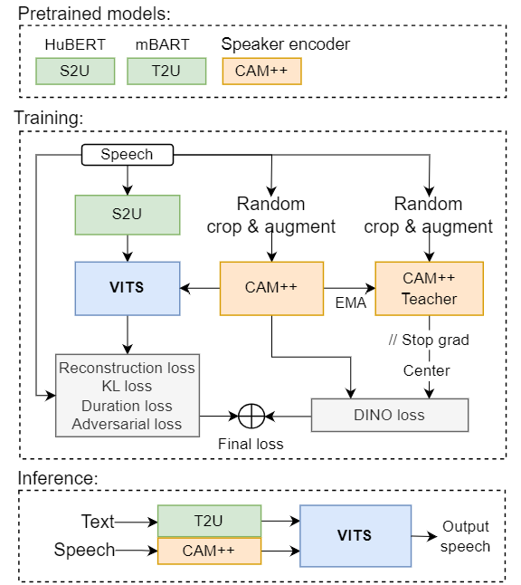

<!-- # DINO-VITS: Data-efficient noise-robust zero-shot voice cloning via multi-tasking with self-supervised speaker verification loss -->
**Vikentii Pankov, Valeria Pronina, Alexander Kuzmin, Maksim Borisov, Nikita Usoltsev, Xingshan Zeng, Alexander Golubkov, Nikolai Ermolenko, Aleksandra Shirshova, Yulia** 

# Abstract
> Recent progress in self-supervised representation learning has opened up new opportunities for training from unlabeled data and has been a growing trend in voice conversion. However, unsupervised training of voice cloning seems to remain a challenging task. In this paper we propose a semi-supervised zero-shot voice cloning approach that works by adapting a HuBERT-based voice conversion system to the voice cloning task and shows the robustness of such a system to noises both in training data (we add noises resulting in up to 0db signal-to-noise-ratio to 35% of training data with no significant degradation of evaluation metrics) and in the target speaker reference audio at inference. Moreover, such a method does not require any type of denoising or noise-labeling of training data. Finally, we introduce a novel multi-tasking approach by incorporating self-supervised DINO loss into joint training of a CAM++ based speaker verification system and a unit-based VITS cloning system. We show that it significantly improves the quality of generated audio over baselines, especially for noisy target speaker references.

[*] this page is intended for **research demonstration purposes** only.

# System architecture

# Robustness to noises at inference and general similarity improvement

<object type="text/html" data="demopage_icassp2024_refnoise_subset.html" width="1000" height="600"  ></object>

# Unsupervised training and robustness to noises in data 
<object type="text/html" data="demopage_icassp2024_corrunits_subset.html" width="1000" height="600"  ></object>

# Broader Impacts

As voice cloning and conversion technologies progress and
grow in quality so does the risk of their misuse for malicious
purposes. That is why special attention should be payed to
developing mitigation strategies. One such strategy is to con-
trol the use of voice cloning systems and ensure inability to
use them in open-domain speech generation without user con-
sent. Another strategy is the development of fake audio detec-
tion systems. In our case the discriminator jointly trained with
our DINO-VITS model can serve as the first step to such a so-
lution. For its evaluation we took real speech recordings from
the full CHiME3 dataset and then measured its accuracy
separately on the outputs of each of the models mentioned in
this paper. The F-score was above 95% for all such evalua-
tions. This shows that GAN discriminators seem to show a
potential for efficiently detecting synthesized speech by mod-
els that share the core generator architecture with the one they
were trained with (HiFi-GAN decoder in our case). However
a more extensive study of this issue should be in order so as
to fully ensure minimization of risk of harm to the end user
related to the said technologies.

